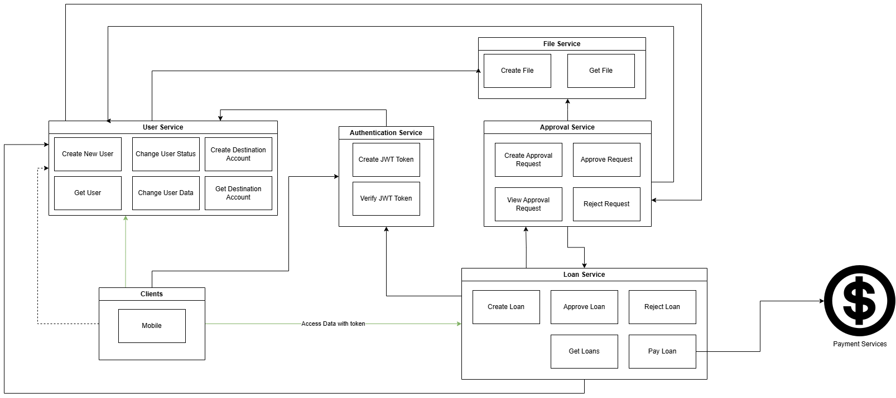
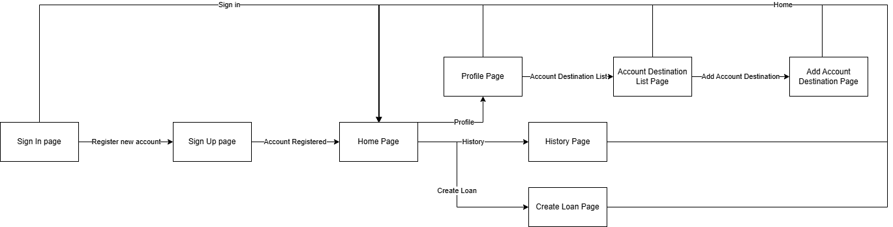
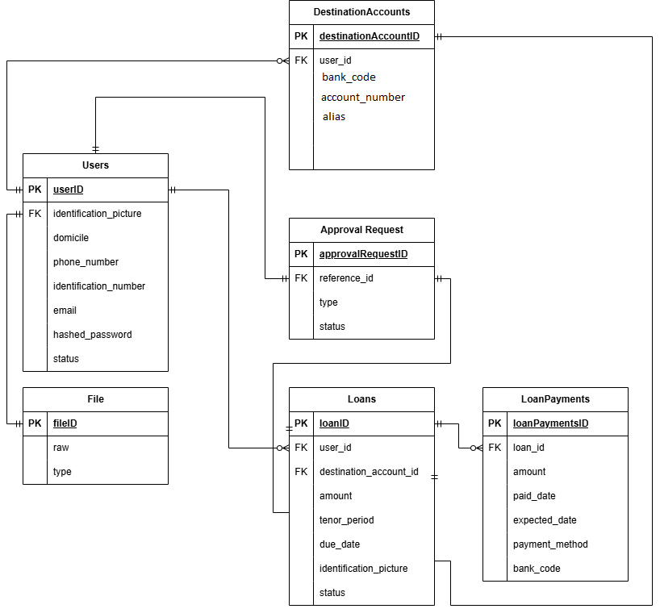
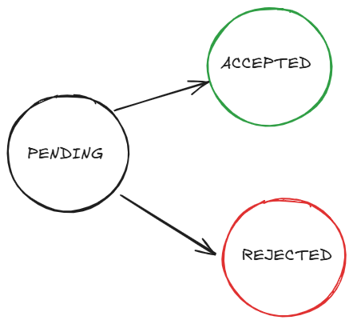

# 1. High Level Architecture Diagram



# 2. Screen Flow & ERD

## Screen Flow diagram


## ERD


# 3. API Design

API Design will be outline per services.

## Authorization Service

JWT authorization service.

## User Service

User service holds all account's details during registration and during sign in, will also hold hashed password.

### POST /users

create new user record

#### Request body

| Field Name| Type |Description |
| ----------- | ----------- | ---------|
| identification_picture | string | foreign_key to the uploaded file
| domicile | string | user domicile data
| phone_number | string | user phone number data
| identification_number | string | user id number 
| email | string | user email data
| hashed_password | string | hashed password

Example
```json
{
    "idenfication_picture": "asdfasdf3534523453",
    "domicile": "BCA",
    "phone_number": "234234234",
    "identification_number": "334523454",
    "email": "Main Bank Account",
    "hashed_password" : "2423452345234"
}
```

#### Response body

| Field Name| Type |Description |
| ----------- | ----------- | ---------|
| id | string | id of the user
| identification_picture | string | foreign_key to the uploaded file
| domicile | string | user domicile data
| phone_number | string | user phone number data
| identification_number | string | user id number 
| email | string | user email data
| status | ENUM (PENDING, ACTIVE, DORMANT) | status of the users

Example
```json
{
    "id": "asdfasdfasdfasdf",
    "idenfication_picture": "asdfasdf3534523453",
    "domicile": "BCA",
    "phone_number": "234234234",
    "identification_number": "334523454",
    "email": "Main Bank Account",
    "status": "PENDING"
}
```

### PATCH /users/:id

update user data

#### Request path
| Field Name| Type |Description |
| ----------- | ----------- | ---------|
| id | string | id of the user

#### Request body
| Field Name| Type |Description |
| ----------- | ----------- | ---------|
| domicile | string | user domicile data
| phone_number | string | user phone number data
| identification_number | string | user id number 

Example
```json
{
    "domicile": "BCA",
    "phone_number": "234234234",
    "identification_number": "334523454"
}
```

#### Response body

| Field Name| Type |Description |
| ----------- | ----------- | ---------|
| id | string | id of the user
| domicile | string | user domicile data
| phone_number | string | user phone number data
| identification_number | string | user id number
| status | ENUM (PENDING, ACTIVE, DORMANT) | status of the users

Example
```json
{
    "id": "asdfasdfasdfasdf",
    "domicile": "BCA",
    "phone_number": "234234234",
    "identification_number": "334523454",
    "status": "PENDING"
}
```

### GET /users/id

get users by id

#### Request path
| Field Name| Type |Description |
| ----------- | ----------- | ---------|
| id | string | user id of the requested

Example:
```text
GET /users/2342323 
```

#### Response body
| Field Name| Type |Description |
| ----------- | ----------- | ---------|
| id | string | id of the user
| domicile | string | user domicile data
| phone_number | string | user phone number data
| identification_number | string | user id number
| status | ENUM (PENDING, ACTIVE, DORMANT) | status of the users

Example
```json
{
    "id": "asdfasdfasdfasdf",
    "domicile": "BCA",
    "phone_number": "234234234",
    "identification_number": "334523454",
    "status": "PENDING"
}
```

### POST /destination-accounts

Create destination account details

#### Request body
| Field Name| Type |Description |
| ----------- | ----------- | ---------|
| bank_code | string | code of the destination bank account
| user_id | string | user that owned the destination bank account
| account_number | string | destination bank account number
| alias | string | alias of the destination account

Example
```json
{
    "id": "asdfasdf3534523453",
    "bank_code": "BCA",
    "user_id": "234234234",
    "account_number": "334523454",
    "alias": "Main Bank Account"
}
```

#### Response body
| Field Name| Type |Description |
| ----------- | ----------- | ---------|
| id | string | file id of the requested
| bank_code | string | code of the destination bank account
| user_id | string | user that owned the destination bank account
| account_number | string | destination bank account number
| alias | string | alias of the destination account

Example
```json
{
    "id": "asdfasdf3534523453",
    "bank_code": "BCA",
    "user_id": "234234234",
    "account_number": "334523454",
    "alias": "Main Bank Account"
}
```

#### Request path
| Field Name| Type |Description |
| ----------- | ----------- | ---------|
| id | string | file id of the requested

Example:
```text
GET /destination-accounts/2342323 
```

#### Response body
| Field Name| Type |Description |
| ----------- | ----------- | ---------|
| id | string | file id of the requested
| bank_code | string | code of the destination bank account
| user_id | string | user that owned the destination bank account
| account_number | string | destination bank account number
| alias | string | alias of the destination account

Example
```json
{
    "id": "asdfasdf3534523453",
    "bank_code": "BCA",
    "account_number": "334523454",
    "alias": "Main Bank Account"
}
```

### GET /destination-accounts/:id

Get destination account details based on id

#### Request path
| Field Name| Type |Description |
| ----------- | ----------- | ---------|
| id | string | file id of the requested

Example:
```text
GET /destination-accounts/2342323 
```

#### Response body
| Field Name| Type |Description |
| ----------- | ----------- | ---------|
| id | string | file id of the requested
| bank_code | string | code of the destination bank account
| account_number | string | destination bank account number
| alias | string | alias of the destination account

Example
```json
{
    "id": "asdfasdf3534523453",
    "bank_code": "BCA",
    "account_number": "334523454",
    "alias": "Main Bank Account"
}
```


## Approval Service

Service responsible for keeping approval requests from both new account creation and new loans.

The status transition is as follows:



Newly created approval will be PENDING. Once the details has been evalutad, then status could change into REJECTED or ACCEPTED

For the sake of simplicity, this service is a oversimplified service for marking requests

APIs as follows:

### POST /approvals

Create new approvals. newly created approval request is always PENDING

#### Request body
| Field Name| Type |Description |
| ----------- | ----------- | ---------|
| reference_id | string | reference id of the approval which refer to the original records
| type | ENUM (JPG, PDF, PNG) | type of the binary

Example:
```json
{
    "reference_id": "asdfasdf3534523453",
    "type": "LOAN"
}
```
#### Response body
| Field Name| Type |Description |
| ----------- | ----------- | ---------|
| id | string | approval id of the requested
| type | ENUM (ACCOUNT_OPENING, LOAN) | type of the requests
| reference_id | string | reference id of the approval which refer to the original records
| status | ENUM (ACCEPTED, REJECTED, PENDING) | status of the approval 

Example
```json
{
    "id": "asdfasdf3534523453",
    "reference_id": "asdfasdf3534523453",
    "status": "PENDING",
    "type": "LOAN"
}
```

### PATCH /approvals/accept/:id
Change status of the certain request to ACCEPTED. A request can only be accepted if the status is PENDING.

#### Request Path
| Field Name| Type |Description |
| ----------- | ----------- | ---------|
| id | string | id if the approval request

#### Response body
| Field Name| Type |Description |
| ----------- | ----------- | ---------|
| id | string | approval id of the requested
| type | ENUM (ACCOUNT_OPENING, LOAN) | type of the requests
| reference_id | string | reference id of the approval which refer to the original records
| status | ENUM (ACCEPTED, REJECTED, PENDING) | status of the approval 

Example
```json
{
    "id": "asdfasdf3534523453",
    "reference_id": "asdfasdf3534523453",
    "status": "ACCEPTED",
    "type": "LOAN"
}
```

### PATCH /approvals/reject/:id
Change status of the certain request to REJECTED. A request can only be accepted if the status is PENDING.

#### Request Path
| Field Name| Type |Description |
| ----------- | ----------- | ---------|
| id | string | id if the approval request

#### Response body
| Field Name| Type |Description |
| ----------- | ----------- | ---------|
| id | string | approval id of the requested
| type | ENUM (ACCOUNT_OPENING, LOAN) | type of the requests
| reference_id | string | reference id of the approval which refer to the original records
| status | ENUM (ACCEPTED, REJECTED, PENDING) | status of the approval 

Example
```json
{
    "id": "asdfasdf3534523453",
    "reference_id": "asdfasdf3534523453",
    "status": "REJECTED",
    "type": "LOAN"
}

### GET /approvals
get approval by parameter

#### Request parameter
| Field Name| Type |Description |
| ----------- | ----------- | ---------|
| reference_id | string | reference id of the approval which refer to the original records
| type | ENUM (ACCOUNT_OPENING, LOAN) | type of the requests

Example:
```text
GET/ reference_id?id=2342323&type=LOAN 
```

#### Response body
| Field Name| Type |Description |
| ----------- | ----------- | ---------|
| id | string | approval id of the requested
| type | ENUM (ACCOUNT_OPENING, LOAN) | type of the requests
| reference_id | string | reference id of the approval which refer to the original records
| status | ENUM (ACCEPTED, REJECTED, PENDING) | status of the approval 

Example
```json
{
    "id": "asdfasdf3534523453",
    "reference_id": "asdfasdf3534523453",
    "status": "PENDING",
    "type": "LOAN"
}
```

## File Service

Service responsible to hold file links to third-party hosting services or raw form of files like pdf or texts.

APIs as follows:

### POST /files
Create file record

#### Request body
| Field Name| Type |Description |
| ----------- | ----------- | ---------|
| raw | string | raw binary of the files
| type | ENUM (JPG, PDF, PNG) | type of the binary

Example:
```json
{
    "raw": "asdfasdf3534523453",
    "type": "JPG"
}
```

#### Response body
| Field Name| Type |Description |
| ----------- | ----------- | ---------|
| file_id | string | the record file id register in the database

Example
```json
{
    "id": "asdfasdf3534523453"
}
```

### GET /file

#### Request parameter
| Field Name| Type |Description |
| ----------- | ----------- | ---------|
| id | string | file id of the requested
| type | ENUM (JPG, PDF, PNG) | type of the binary

Example:
```text
GET/ file?id=2342323&type=JPG 
```

#### Response body
| Field Name| Type |Description |
| ----------- | ----------- | ---------|
| id | string | file id of the requested
| type | ENUM (JPG, PDF, PNG) | type of the binary
| raw | string | raw binary of the files

Example
```json
{
    "id": "asdfasdf3534523453",
    "raw": "asdfasdf3534523453",
    "type": "JPG"
}
```

## Loan Service


## 4. Screen Flow Detail


